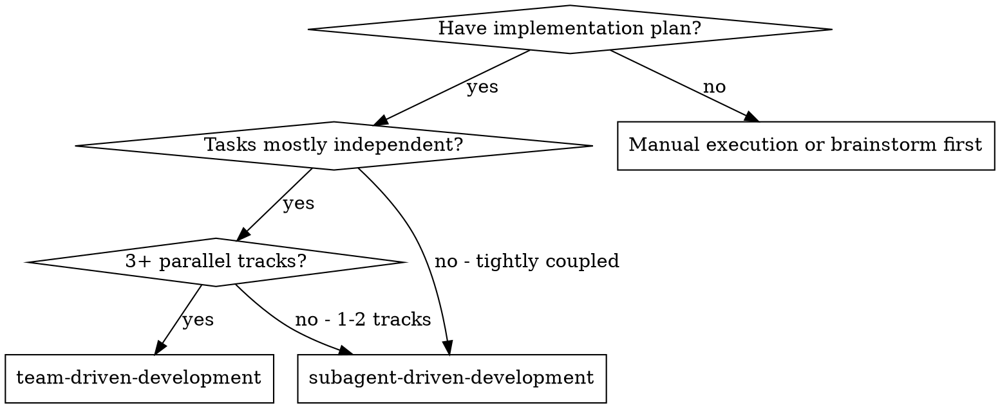
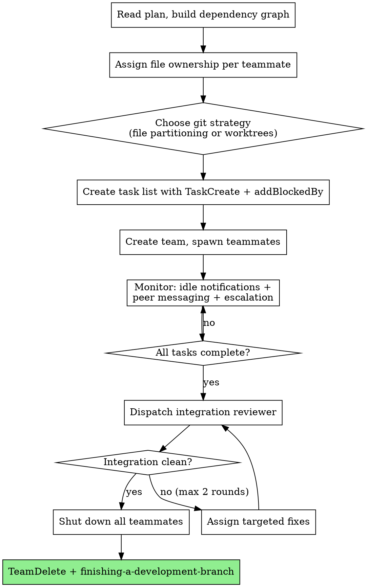

# Team-Driven Development Implementation Plan

> **For agentic workers:** REQUIRED SUB-SKILL: Use superpowers:subagent-driven-development (recommended) or superpowers:executing-plans to implement this plan task-by-task. Steps use checkbox (`- [ ]`) syntax for tracking.

**Goal:** Create a new `team-driven-development` skill that enables parallel plan execution using Claude Code's experimental agent teams, with hybrid communication (peer messaging + lead coordination) and adaptive review (plan approval + self-review + integration review).

**Architecture:** Four files in `skills/team-driven-development/`: SKILL.md (main reference with frontmatter, orchestrator workflow, communication protocol, review strategy), orchestrator-prompt.md (lead's operating guide), team-implementer-prompt.md (teammate spawn prompt template), integration-reviewer-prompt.md (cross-agent review template). One modification to `skills/writing-plans/SKILL.md` to add team-driven as a third execution handoff option. One new test prompt in `tests/skill-triggering/prompts/` and registration in `run-all.sh`.

**Tech Stack:** Markdown skill documents following superpowers SKILL.md conventions. Bash test scripts following existing `tests/skill-triggering/` patterns.

**Spec:** `docs/superpowers/specs/2026-03-29-team-driven-development-design.md`

---

## File Structure

```
skills/team-driven-development/
├── SKILL.md                        # Main skill reference (frontmatter + all sections)
├── orchestrator-prompt.md          # Lead's operating guide for team coordination
├── team-implementer-prompt.md      # Spawn prompt template for each teammate
├── integration-reviewer-prompt.md  # Cross-agent integration review template

tests/skill-triggering/
├── prompts/
│   └── team-driven-development.txt # Triggering test prompt (NEW)
└── run-all.sh                      # Add team-driven-development to SKILLS array (MODIFY)

skills/writing-plans/
└── SKILL.md                        # Add third handoff option (MODIFY)
```

---

### Task 1: Create SKILL.md — Frontmatter and Overview

**Files:**
- Create: `skills/team-driven-development/SKILL.md`

- [ ] **Step 1: Create SKILL.md with frontmatter, platform gate, and overview**

```markdown
---
name: team-driven-development
description: Use when executing implementation plans with 3+ independent parallel tracks that benefit from inter-agent communication and coordination
---

# Team-Driven Development

**Platform requirement:** This skill requires Claude Code v2.1.32+ with agent teams enabled (`CLAUDE_CODE_EXPERIMENTAL_AGENT_TEAMS=1` in environment or settings.json). On other platforms (Cursor, Codex, OpenCode, Gemini CLI), use subagent-driven-development or executing-plans instead.

Execute plan by creating an agent team where multiple teammates work simultaneously on independent tracks, communicate directly with each other via SendMessage, and coordinate through a shared task list — delivering faster execution than sequential subagent-driven-development.

**Why agent teams over subagents:** Teammates are fully independent Claude Code sessions that message each other directly, self-claim tasks from a shared list, and load project context (CLAUDE.md, MCP servers, skills) automatically. Unlike subagents, teammates don't report through a controller bottleneck — they coordinate peer-to-peer.

**Core principle:** Parallel tracks + peer communication + adaptive review = speed without sacrificing quality

## When to Use



**vs. Subagent-Driven Development:**

| | Subagent-Driven Development | Team-Driven Development |
|---|---|---|
| **Context** | Own window; results return to controller | Own window; fully independent |
| **Communication** | Report back to controller only | Teammates message each other directly |
| **Coordination** | Controller manages all work | Shared task list with self-claiming |
| **Best for** | Sequential tasks, tight dependencies | Parallel work requiring discussion |
| **Token cost** | Lower (results summarized back) | Higher (each teammate = separate instance) |

**Don't use when:**
- Sequential tasks with heavy dependencies
- Same-file edits that can't be partitioned
- Fewer than 3 parallelizable tasks (overhead exceeds benefit)
- Routine/small tasks where token cost isn't justified
```

- [ ] **Step 2: Verify file exists and frontmatter is valid**

Run: `head -5 skills/team-driven-development/SKILL.md`
Expected: YAML frontmatter with `name: team-driven-development` and `description: Use when...`

- [ ] **Step 3: Commit**

```bash
git add skills/team-driven-development/SKILL.md
git commit -m "feat: add team-driven-development SKILL.md with frontmatter and overview"
```

---

### Task 2: Add SKILL.md — Prerequisites and Team Sizing

**Files:**
- Modify: `skills/team-driven-development/SKILL.md`

- [ ] **Step 1: Append prerequisites, display mode, team sizing, and platform sections**

Append after the "Don't use when" list:

```markdown
## Prerequisites

- Claude Code v2.1.32 or later (`claude --version` to check)
- Agent teams enabled — set in environment or settings.json:
  ```json
  {
    "env": {
      "CLAUDE_CODE_EXPERIMENTAL_AGENT_TEAMS": "1"
    }
  }
  ```
- Pre-approve common operations (file edits, bash commands) in permission settings before spawning — teammates inherit the lead's permission mode and permission prompts create friction.
- tmux or iTerm2 (with `it2` CLI + Python API enabled) for split-pane mode. Optional — in-process mode works in any terminal.

**Display mode:** Configure in `~/.claude.json` with `"teammateMode": "in-process"` or `"tmux"`, or per-session with `claude --teammate-mode in-process`. Default `"auto"` uses split panes inside tmux, in-process otherwise.

## Team Sizing

- **Minimum:** 2 teammates (below this → use SDD)
- **Sweet spot:** 3-4 teammates
- **Maximum:** 5 teammates (beyond this, coordination overhead exceeds benefit)
- **Tasks per teammate:** 5-6 keeps everyone productive
- **Rule of thumb:** one teammate per independent track in the plan

**Cost awareness:** Token usage scales linearly with team size. Each teammate has its own context window. Use when parallelism saves more time than the tokens cost.

## Platform Constraints

- One team per session — clean up current team before starting a new one
- Lead is fixed for the session's lifetime — can't promote a teammate
- No nested teams — teammates cannot spawn their own teams
- No session resumption — `/resume` and `/rewind` don't restore in-process teammates; spawn new ones after resuming
- Split-pane mode not supported in VS Code integrated terminal, Windows Terminal, or Ghostty
```

- [ ] **Step 2: Verify the appended sections render correctly**

Run: `grep -c "^##" skills/team-driven-development/SKILL.md`
Expected: 5 (Overview section headers from Task 1 + 3 new section headers)

- [ ] **Step 3: Commit**

```bash
git add skills/team-driven-development/SKILL.md
git commit -m "feat: add prerequisites, team sizing, and platform constraints to SKILL.md"
```

---

### Task 3: Add SKILL.md — Orchestrator Workflow

**Files:**
- Modify: `skills/team-driven-development/SKILL.md`

- [ ] **Step 1: Append the orchestrator workflow section**

Append after Platform Constraints:

```markdown
## The Process

The lead (main session) orchestrates the entire lifecycle. Teammates are fully independent Claude Code sessions.



### Phase 1 — Analyze Plan

- Read the plan file, extract all tasks with full text
- Build dependency graph: explicit ("requires Task N") and implicit (shared files, output→input)
- Group independent tasks into parallel tracks
- If fewer than 3 parallel tracks → recommend SDD instead
- Team size: one teammate per track, capped at 5. Target 5-6 tasks per teammate.

### Phase 2 — Assign File Ownership

**Each file gets exactly one owner. No exceptions — parallel edits cause unpredictable overwrites.**

- New files → assigned to the track that creates them
- Existing files being modified → assigned to the track with the most edits
- Shared types/interfaces → created by one track, read-only for others
- If clean partitioning is impossible → use `using-git-worktrees` for per-teammate branches

### Phase 3 — Create Task List

- `TaskCreate` for every task from the plan with full text description
- Set `addBlockedBy` for dependencies — system auto-unblocks when predecessors complete
- Tasks start `pending` — teammates self-claim (file locking prevents race conditions)
- Lead can explicitly assign tasks when domain expertise matters

### Phase 4 — Create Team & Spawn

Each teammate's spawn prompt includes:
- Track focus area and expertise
- File ownership map (their files + all teammates' files for reference)
- Shared interfaces/contracts
- Peer teammate names for direct messaging
- Communication protocol (see below)

Lead's conversation history does NOT carry over — all context must be in the spawn prompt. Project context (CLAUDE.md, MCP servers, skills) loads automatically.

**Plan approval mode:** For risky tracks (core architecture, shared infrastructure), require plan approval — teammate drafts plan in read-only mode, lead approves or rejects with feedback. Set criteria in spawn prompt (e.g., "only approve plans that include test coverage").

### Phase 5 — Monitor & Coordinate

- **Idle notifications** arrive automatically when teammates finish work
- **Lead stays hands-off** — coordinate and route, do NOT implement tasks. If you start coding, stop and wait.
- **Task dependency flow** — completed tasks auto-unblock dependents
- **Task status lag** — if a task appears stuck, check if work is done and update manually via `TaskUpdate`
- **User can intervene** — Shift+Down (in-process) or click pane (split-pane) to message any teammate directly

### Phase 6 — Integration Review

After all tasks complete, dispatch integration reviewer (see `./integration-reviewer-prompt.md`). Maximum 2 review rounds — if critical issues persist, escalate to user.

### Phase 7 — Cleanup

- Send shutdown request to each teammate. They approve or reject (if still working).
- **All teammates must be shut down before TeamDelete** — it fails if any are running.
- Orphaned tmux sessions: `tmux kill-session -t <session-name>`
- If worktree mode: merge branches, clean up worktrees
- Invoke `finishing-a-development-branch`

**Storage:** Team config at `~/.claude/teams/{team-name}/config.json`, task list at `~/.claude/tasks/{team-name}/`.
```

- [ ] **Step 2: Verify section was appended**

Run: `grep "^## The Process" skills/team-driven-development/SKILL.md`
Expected: `## The Process`

- [ ] **Step 3: Commit**

```bash
git add skills/team-driven-development/SKILL.md
git commit -m "feat: add orchestrator workflow to SKILL.md"
```

---

### Task 4: Add SKILL.md — Communication Protocol

**Files:**
- Modify: `skills/team-driven-development/SKILL.md`

- [ ] **Step 1: Append the communication protocol section**

Append after the Phase 7 / Storage section:

```markdown
## Communication Protocol

Every teammate receives this protocol in their spawn prompt.

**Three channels:**

| Channel | Mechanism | When |
|---|---|---|
| **Peer-to-peer** | `SendMessage` type `message` to named teammate | Quick questions, sharing outputs, discoveries affecting one peer |
| **Broadcast** | `SendMessage` type `broadcast` | Team-wide announcements (interface changes). Use sparingly — costs scale with team size. |
| **Escalate to lead** | `SendMessage` type `message` to lead | Architectural decisions, file ownership conflicts, peer can't resolve |

**Message guidelines:**
- Plain text, not structured JSON
- Messages delivered automatically — send and continue working
- Be specific: "I need the response shape for GET /api/users" not "I have a question"
- Include file paths when referencing code
- Keep short — each message costs tokens for the recipient

**Anti-patterns:**
- Don't broadcast what affects only one peer — direct message them
- Don't poll peers for status — check the task list
- Don't have extended conversations — if 2-3 messages don't resolve it, escalate to lead
- Don't use lead as relay — message peers directly

**User interaction:** Shift+Down (in-process) or click pane (split-pane) to message any teammate directly. Ctrl+T toggles the task list.
```

- [ ] **Step 2: Verify section was appended**

Run: `grep "^## Communication Protocol" skills/team-driven-development/SKILL.md`
Expected: `## Communication Protocol`

- [ ] **Step 3: Commit**

```bash
git add skills/team-driven-development/SKILL.md
git commit -m "feat: add communication protocol to SKILL.md"
```

---

### Task 5: Add SKILL.md — Adaptive Review Strategy

**Files:**
- Modify: `skills/team-driven-development/SKILL.md`

- [ ] **Step 1: Append the review strategy section**

Append after the Communication Protocol section:

```markdown
## Adaptive Review Strategy

Three layers replace SDD's per-task two-reviewer model to avoid bottlenecking parallel execution.

| Layer | When | Mechanism | Purpose |
|---|---|---|---|
| **Plan approval** | Before implementation (selective) | Built-in plan mode | Catch direction problems before code is written |
| **Self-review** | After every task | Inline in team-implementer prompt | Catch issues without dispatching a reviewer |
| **Integration review** | After all teammates finish | `./integration-reviewer-prompt.md` | Catch cross-cutting issues no single agent can see |

**Plan approval (selective):** Use for tracks touching core architecture or shared infrastructure. Skip for straightforward tasks with clear specs. Lead decides at spawn time.

**Self-review (every task):** Completeness, quality, file ownership discipline, testing, contract compliance. Plan approval validates *what* to build; self-review validates *how* it was built. Both apply.

**Integration review (once):** Contract compliance across tracks, naming consistency, conflict detection, data flow, cross-track test coverage. Maximum 2 rounds — escalate to user if issues persist.

**Why not per-task review?** With 4 agents × 5 tasks × 2 reviews = 40 reviewer dispatches. Adaptive strategy: N plan approvals (selective) + 0 dispatches during execution + 1 integration review. Same quality, no bottleneck.

**Optional quality gates:** Configure `TaskCompleted` hook (exit code 2 prevents completion), `TeammateIdle` hook (keeps teammates working), `TaskCreated` hook (enforces task standards).
```

- [ ] **Step 2: Verify section was appended**

Run: `grep "^## Adaptive Review Strategy" skills/team-driven-development/SKILL.md`
Expected: `## Adaptive Review Strategy`

- [ ] **Step 3: Commit**

```bash
git add skills/team-driven-development/SKILL.md
git commit -m "feat: add adaptive review strategy to SKILL.md"
```

---

### Task 6: Add SKILL.md — Error Handling and Integration

**Files:**
- Modify: `skills/team-driven-development/SKILL.md`

- [ ] **Step 1: Append error handling, red flags, and integration sections**

Append after the Adaptive Review Strategy section:

```markdown
## Error Recovery

| Failure | Recovery |
|---|---|
| **Teammate stuck** | Lead messages directly. If unrecoverable, spawn replacement with same file ownership. |
| **Teammate edits wrong files** | Revert unauthorized changes. Reassign fix to correct owner. |
| **Teammate claims wrong task** | Lead reassigns via `TaskUpdate`. Revert if work started on wrong files. |
| **Task status lag** | Lead checks if work done, manually updates `TaskUpdate` or nudges teammate. |
| **Plan approval loop (3+ rejections)** | Lead provides the plan directly or spawns replacement with more context. |
| **Peer message unanswered** | Lead routes the answer or nudges the receiver. |
| **Lead starts implementing** | User tells lead: "Wait for your teammates to complete their tasks." |
| **File conflict despite ownership** | Lead determines correct version using ownership map. Assigns fix to owner. |
| **Shared interface changes mid-execution** | Changing teammate MUST broadcast immediately. Lead verifies acknowledgment. |
| **Multiple teammates fail** | Lead triages: related (fix root cause) or independent (spawn replacements). |
| **TeamDelete blocks** | Shut down all teammates first. If unresponsive: `tmux kill-session -t <name>`. |
| **Session interrupted** | On resume: spawn new teammates, check task list for incomplete tasks. |
| **Integration issues after 2 rounds** | Escalate to user. Don't loop endlessly. |

## Red Flags

**Never:**
- Start implementation without creating file ownership map first
- Let two teammates edit the same file
- Skip integration review because "self-review is enough"
- Let lead implement tasks instead of coordinating
- Ignore teammate escalations (BLOCKED, NEEDS_CONTEXT)
- Send broadcast for single-peer questions
- Loop integration review more than 2 rounds
- Force-kill teammates without sending shutdown request first

## Integration

**Required workflow skills:**
- **superpowers:using-git-worktrees** — Set up feature branch before starting; per-teammate branches if file overlap unavoidable
- **superpowers:writing-plans** — Creates the plan this skill executes
- **superpowers:finishing-a-development-branch** — Complete development after all tasks

**Teammates automatically use:**
- **superpowers:test-driven-development** — TDD when the plan specifies it
- **superpowers:systematic-debugging** — Available if teammates hit bugs
- **superpowers:verification-before-completion** — Verify before marking tasks done

**Prompt templates:**
- `./orchestrator-prompt.md` — Lead's operating guide
- `./team-implementer-prompt.md` — Teammate spawn prompt
- `./integration-reviewer-prompt.md` — Cross-agent integration review
```

- [ ] **Step 2: Verify all major sections exist**

Run: `grep "^## " skills/team-driven-development/SKILL.md`
Expected output should include: When to Use, Prerequisites, Team Sizing, Platform Constraints, The Process, Communication Protocol, Adaptive Review Strategy, Error Recovery, Red Flags, Integration

- [ ] **Step 3: Commit**

```bash
git add skills/team-driven-development/SKILL.md
git commit -m "feat: add error handling, red flags, and integration to SKILL.md"
```

---

### Task 7: Create orchestrator-prompt.md

**Files:**
- Create: `skills/team-driven-development/orchestrator-prompt.md`

- [ ] **Step 1: Create the orchestrator prompt**

```markdown
# Orchestrator Prompt — Team-Driven Development

Reference guide for the lead agent coordinating a team. Not dispatched as a subagent — this is your operating manual.

## Step-by-Step

### 1. Analyze Plan

```
Read plan file once. Extract ALL tasks with full text.
Build dependency graph:
  - Explicit: "requires Task N", "after Task N"
  - Implicit: shared files, output→input relationships
Group into parallel tracks. Count them.

If < 3 parallel tracks → recommend subagent-driven-development instead.
```

### 2. Assign File Ownership

```
For each task, list files created or modified.
Assign each file to exactly ONE teammate:
  - New files → track that creates them
  - Modified files → track with most edits to that file
  - Shared types/interfaces → one track creates, others read-only

If ANY file must be edited by multiple tracks → switch to worktree mode
(use superpowers:using-git-worktrees for per-teammate branches).
```

### 3. Size the Team

```
Count parallel tracks → one teammate per track
Check: 5-6 tasks per teammate? If not, adjust:
  - Too few tasks per teammate → reduce team size
  - Too many → split tracks or add teammates
Cap at 5 teammates. Minimum 2.
```

### 4. Create Task List

```
TaskCreate for EVERY task:
  - subject: "Task N: [name]"
  - description: FULL task text from plan (don't make teammates read file)
  - Set addBlockedBy for dependencies

All tasks start pending. Teammates self-claim.
Use TaskUpdate to manually unblock stuck tasks if needed.
```

### 5. Prepare Spawn Context

Write a spawn context block containing:
- Shared interfaces/contracts between tracks
- File ownership map: teammate → files they own
- Communication protocol summary
- Peer teammate names and their track focus

### 6. Create Team

Spawn each teammate with:
- Their track focus area
- Spawn context block
- Instructions to self-claim from shared task list
- For risky tracks: require plan approval mode
  - Set criteria: "only approve plans that [specific requirement]"

Lead's history does NOT carry over. Put everything in the spawn prompt.
Teammates auto-load CLAUDE.md, MCP servers, skills.

### 7. Monitor

- Idle notifications arrive automatically when teammates stop
- Route escalations promptly
- DO NOT implement tasks yourself — coordinate only
- If task appears stuck: check if work done, update TaskUpdate, or nudge
- Reuse idle teammates: assign them unblocked tasks from other tracks (update file ownership)

### 8. Integration Review

When all tasks complete:
- Dispatch integration reviewer with:
  - File ownership map
  - Shared context (interfaces/contracts)
  - git diff (base SHA → head SHA)
  - Original plan path
- Maximum 2 review rounds. Escalate to user if issues persist.

### 9. Cleanup

```
1. Send shutdown request to each teammate
2. Wait for approval (reject = still working, wait and re-request)
3. If unresponsive: advise user to tmux kill-session -t <name>
4. TeamDelete (fails if any teammates still running)
5. If worktree mode: merge branches, clean up worktrees
6. Invoke superpowers:finishing-a-development-branch
```
```

- [ ] **Step 2: Verify file exists**

Run: `head -3 skills/team-driven-development/orchestrator-prompt.md`
Expected: `# Orchestrator Prompt — Team-Driven Development`

- [ ] **Step 3: Commit**

```bash
git add skills/team-driven-development/orchestrator-prompt.md
git commit -m "feat: add orchestrator prompt template"
```

---

### Task 8: Create team-implementer-prompt.md

**Files:**
- Create: `skills/team-driven-development/team-implementer-prompt.md`

- [ ] **Step 1: Create the team implementer prompt template**

```markdown
# Team Implementer Prompt Template

Use this template when spawning each teammate. Fill in bracketed placeholders.

```
You are a teammate on an agent team implementing [plan name].

## Your Track

[Track focus area and expertise]

## Your Tasks

Claim tasks from the shared task list. Work through them in dependency order.
When you finish a task, mark it complete and claim the next available one.

## Environment

Project context (CLAUDE.md, MCP servers, skills) loads automatically.
You don't need to ask for project setup information.

Task claiming is race-safe (file locking). If you and another teammate
try to claim the same task simultaneously, only one will get it.
The other should claim the next available task.

## File Ownership

You may ONLY create or edit these files:
[File ownership list]

Do NOT edit files outside your ownership. If you need a change to a file
you don't own, message the teammate who owns it.

## Shared Context

[Interfaces, contracts, data models all teammates need]

## Your Teammates

[Name — track focus — files they own]

Use SendMessage to communicate directly with peers.

## Communication Protocol

**Message a peer when:**
- You need info about a file or interface they own
- You've produced output they'll consume
- You've discovered something that affects their work

**Broadcast when:**
- A shared interface has changed (use sparingly)

**Escalate to lead when:**
- You need to edit a file you don't own
- You and a peer disagree on an approach
- You're blocked and no peer can help

Messages are delivered automatically. Send and continue working.
Keep messages short, specific, and actionable.
Don't poll peers for status — check the task list.
If a peer exchange goes past 2-3 messages without resolution, escalate to lead.

## Plan Approval

You may start in plan mode. If so, draft your implementation plan
and submit it. The lead will approve or reject with feedback. If
rejected, revise and resubmit. You stay in plan mode until approved.
Not all teammates require plan approval — the lead decides at spawn time.

## Before You Begin Each Task

If you have questions about requirements, approach, dependencies, or
anything unclear — ask now. Message a peer or escalate to lead.
Don't guess or make assumptions.

## While You Work

- Follow TDD if the plan specifies it
- Stay within your file ownership
- Honor shared interfaces from the spawn context
- If you encounter something unexpected, pause and ask

## Code Organization

- Follow the file structure defined in the plan
- Each file should have one clear responsibility with a well-defined interface
- If a file you're creating grows beyond the plan's intent, stop and report
  as DONE_WITH_CONCERNS — don't split files without plan guidance
- If an existing file you're modifying is already large or tangled, work
  carefully and note it as a concern in your report
- In existing codebases, follow established patterns

## Self-Review (after every task)

Before marking a task complete, review with fresh eyes:

- **Completeness:** Did I implement everything in the task spec?
- **Quality:** Are names clear? Is the code clean?
- **Discipline:** Did I stay within my file ownership? Did I avoid overbuilding?
- **Testing:** Do tests verify behavior?
- **Contracts:** Does my work honor the shared interfaces?

Fix issues before marking complete. Plan approval validates your approach;
self-review validates your implementation. Both matter.

Note: The TaskCompleted hook may enforce additional quality gates
(e.g., tests must pass before marking done). If your task completion
is rejected, fix the issue and try again.

## When You're In Over Your Head

It is always OK to stop and say "this is too hard for me." Bad work is
worse than no work.

STOP and escalate when:
- The task requires architectural decisions with multiple valid approaches
- You need to understand code beyond what was provided
- You feel uncertain about your approach
- The task involves restructuring outside your ownership

How to escalate: Message the lead with status BLOCKED or NEEDS_CONTEXT.
Describe what you're stuck on, what you've tried, and what help you need.

## Report Format (per task)

When done with each task:
- **Status:** DONE | DONE_WITH_CONCERNS | BLOCKED | NEEDS_CONTEXT
- What you implemented
- What you tested and results
- Files changed (must all be within your ownership)
- Self-review findings (if any)
- Any concerns or issues

Mark the task complete in the shared task list, then claim the next
available unblocked task.

## Shutdown

The lead may send you a shutdown request when your work is done.
- If you've completed all your tasks: approve and exit gracefully
- If you still have in-progress work: reject with explanation of what
  remains, finish the work, then approve on the next request
```
```

- [ ] **Step 2: Verify file exists**

Run: `head -3 skills/team-driven-development/team-implementer-prompt.md`
Expected: `# Team Implementer Prompt Template`

- [ ] **Step 3: Commit**

```bash
git add skills/team-driven-development/team-implementer-prompt.md
git commit -m "feat: add team implementer prompt template"
```

---

### Task 9: Create integration-reviewer-prompt.md

**Files:**
- Create: `skills/team-driven-development/integration-reviewer-prompt.md`

- [ ] **Step 1: Create the integration reviewer prompt template**

```markdown
# Integration Reviewer Prompt Template

Use this template when dispatching the integration reviewer after all teammates complete.

**Purpose:** Find problems that NO SINGLE AGENT could see — issues that only appear when combining everyone's work.

**Only dispatch after all teammates have completed all tasks.**

```
You are reviewing the combined output of an agent team that worked
in parallel on [plan name].

## What Was Built

[Summary of all tracks and what each teammate implemented]

## Review Inputs

- File ownership map: [who owned what]
- Shared context: [interfaces, contracts, data models]
- Git diff of all changes: [base SHA → head SHA]
- Original plan: [plan file path]

## Your Job

You are looking for problems that NO SINGLE AGENT could see — issues
that only appear when combining everyone's work.

**Contract compliance:**
- Do all tracks honor the shared interfaces?
- Does Track A's API output match what Track B's consumer expects?
- Are types compatible end-to-end across track boundaries?

**Consistency:**
- Naming conventions consistent across all agents' work?
- Error handling patterns consistent?
- Logging formats consistent?

**Conflict detection:**
- Any files edited by multiple agents despite ownership rules?
- Any semantic conflicts (e.g., two tracks defining same constant differently)?
- Any duplicate code that should be shared?

**Data flow:**
- Does data flow correctly across track boundaries?
- Are there missing transformations between what one track produces and
  another consumes?

**Test coverage:**
- Do cross-track integration scenarios have test coverage?
- Do tests from different tracks interfere with each other?

**Spec compliance:**
- Does the combined output satisfy the original plan's requirements?
- Is anything missing that no individual track was responsible for?

## Review Limits

Maximum 2 integration review rounds. If critical issues persist after
2 rounds, flag to the lead for user escalation. Don't loop endlessly.

## Report Format

- PASS — if everything checks out
- ISSUES FOUND:
  - **Critical** (must fix): [issue, affected files, which teammate should fix]
  - **Important** (should fix): [issue, affected files, recommendation]
  - **Minor** (suggestions): [observation, recommendation]

For each issue, specify which teammate's file ownership it falls under
so the lead can assign the fix correctly.
```
```

- [ ] **Step 2: Verify file exists**

Run: `head -3 skills/team-driven-development/integration-reviewer-prompt.md`
Expected: `# Integration Reviewer Prompt Template`

- [ ] **Step 3: Commit**

```bash
git add skills/team-driven-development/integration-reviewer-prompt.md
git commit -m "feat: add integration reviewer prompt template"
```

---

### Task 10: Add writing-plans handoff option

**Files:**
- Modify: `skills/writing-plans/SKILL.md`

- [ ] **Step 1: Update the execution handoff section**

In `skills/writing-plans/SKILL.md`, find the "Execution Handoff" section (around line 136). Replace the current handoff section with:

```markdown
## Execution Handoff

After saving the plan, offer execution choice:

**"Plan complete and saved to `docs/superpowers/plans/<filename>.md`. Three execution options:**

**1. Subagent-Driven (recommended for most plans)** - I dispatch a fresh subagent per task, review between tasks, fast iteration

**2. Team-Driven (for plans with 3+ parallel tracks; Claude Code only)** - I create an agent team with parallel teammates, peer communication, integration review at the end

**3. Inline Execution** - Execute tasks in this session using executing-plans, batch execution with checkpoints

**Which approach?"**

**If Subagent-Driven chosen:**
- **REQUIRED SUB-SKILL:** Use superpowers:subagent-driven-development
- Fresh subagent per task + two-stage review

**If Team-Driven chosen:**
- **REQUIRED SUB-SKILL:** Use superpowers:team-driven-development
- Parallel teammates + peer messaging + integration review
- Requires Claude Code with agent teams enabled

**If Inline Execution chosen:**
- **REQUIRED SUB-SKILL:** Use superpowers:executing-plans
- Batch execution with checkpoints for review
```

- [ ] **Step 2: Also update the plan document header template**

In the same file, find the plan document header template (around line 52). Update the agentic workers line:

Find:
```
> **For agentic workers:** REQUIRED SUB-SKILL: Use superpowers:subagent-driven-development (recommended) or superpowers:executing-plans to implement this plan task-by-task. Steps use checkbox (`- [ ]`) syntax for tracking.
```

Replace with:
```
> **For agentic workers:** REQUIRED SUB-SKILL: Use superpowers:subagent-driven-development (recommended), superpowers:team-driven-development (for 3+ parallel tracks), or superpowers:executing-plans to implement this plan task-by-task. Steps use checkbox (`- [ ]`) syntax for tracking.
```

- [ ] **Step 3: Verify changes**

Run: `grep -c "team-driven" skills/writing-plans/SKILL.md`
Expected: 3 or more occurrences (header template + handoff option + required sub-skill)

- [ ] **Step 4: Commit**

```bash
git add skills/writing-plans/SKILL.md
git commit -m "feat: add team-driven-development as third execution handoff option in writing-plans"
```

---

### Task 11: Add skill triggering test

**Files:**
- Create: `tests/skill-triggering/prompts/team-driven-development.txt`
- Modify: `tests/skill-triggering/run-all.sh`

- [ ] **Step 1: Create the triggering test prompt**

```text
I have an implementation plan with 15 tasks organized into 4 independent tracks:
- Database models and migrations (4 tasks)
- REST API endpoints (4 tasks)
- Frontend React components (4 tasks)
- Test infrastructure and integration tests (3 tasks)

These tracks are mostly independent - each touches different files. I'd like to execute this plan as fast as possible with multiple agents working in parallel and communicating with each other when they need to coordinate on shared interfaces.

Can you help me execute this plan?
```

- [ ] **Step 2: Add team-driven-development to the SKILLS array in run-all.sh**

In `tests/skill-triggering/run-all.sh`, find the SKILLS array (around line 10). Add `"team-driven-development"` to the array:

Find:
```bash
SKILLS=(
    "systematic-debugging"
    "test-driven-development"
    "writing-plans"
    "dispatching-parallel-agents"
    "executing-plans"
    "requesting-code-review"
)
```

Replace with:
```bash
SKILLS=(
    "systematic-debugging"
    "test-driven-development"
    "writing-plans"
    "dispatching-parallel-agents"
    "executing-plans"
    "requesting-code-review"
    "team-driven-development"
)
```

- [ ] **Step 3: Verify test prompt exists and run-all.sh is updated**

Run: `cat tests/skill-triggering/prompts/team-driven-development.txt | wc -l`
Expected: 10 (or similar — file has content)

Run: `grep "team-driven-development" tests/skill-triggering/run-all.sh`
Expected: `    "team-driven-development"`

- [ ] **Step 4: Commit**

```bash
git add tests/skill-triggering/prompts/team-driven-development.txt tests/skill-triggering/run-all.sh
git commit -m "feat: add skill triggering test for team-driven-development"
```

---

### Task 12: Plan self-review and final verification

**Files:**
- All files created/modified in Tasks 1-11

- [ ] **Step 1: Verify all files exist**

Run:
```bash
ls -la skills/team-driven-development/
```
Expected: 4 files — SKILL.md, orchestrator-prompt.md, team-implementer-prompt.md, integration-reviewer-prompt.md

- [ ] **Step 2: Verify SKILL.md frontmatter**

Run: `head -4 skills/team-driven-development/SKILL.md`
Expected: Valid YAML frontmatter with `name: team-driven-development` and description starting with "Use when"

- [ ] **Step 3: Verify all SKILL.md sections present**

Run: `grep "^## " skills/team-driven-development/SKILL.md`
Expected sections: When to Use, Prerequisites, Team Sizing, Platform Constraints, The Process, Communication Protocol, Adaptive Review Strategy, Error Recovery, Red Flags, Integration

- [ ] **Step 4: Verify writing-plans handoff updated**

Run: `grep "team-driven" skills/writing-plans/SKILL.md`
Expected: 3+ matches (header, handoff option, required sub-skill)

- [ ] **Step 5: Verify test infrastructure**

Run: `grep "team-driven-development" tests/skill-triggering/run-all.sh`
Expected: Listed in SKILLS array

Run: `test -f tests/skill-triggering/prompts/team-driven-development.txt && echo "exists"`
Expected: `exists`

- [ ] **Step 6: Run word count to check token efficiency**

Run: `wc -w skills/team-driven-development/SKILL.md`
Expected: Under 2000 words (complex skill, but should be concise)

- [ ] **Step 7: Commit final state if any cleanup was needed**

```bash
git status
# Only commit if there are changes from cleanup
```
