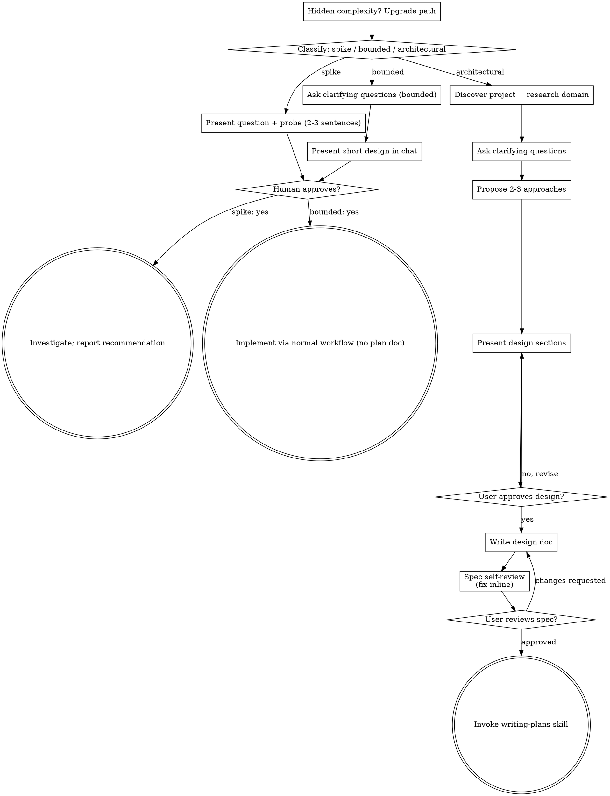

# Brainstorming Ideas Into Designs

Help turn ideas into fully formed designs and specs through natural collaborative dialogue.

Start by classifying how much process the request needs, then work
through your path: understand the context, refine the idea, present a
design, and get your human partner's approval.

<HARD-GATE>
Do NOT invoke any implementation skill, write any code, scaffold any
project, or take any implementation action until you have told your
human partner what you intend and they have approved it. This applies
to EVERY task on EVERY path below — the ceremony scales with the task;
the approval gate never does.
</HARD-GATE>

## Three Paths

Before your first question, classify the request and say the
classification out loud — "this looks bounded, so I'll present a short
design here rather than write a spec" — so your human partner can
override it:

- **Spike** — a feasibility question ("can we...", "is it possible...",
  "quick and dirty is fine") whose output is an answer, not code you
  keep. Present the question and what you'll try in 2-3 sentences, get
  a nod, then find out as cheaply as correctness allows. No design
  doc, no spec file. Report findings as a recommendation; anything you
  built stays labeled throwaway.
- **Bounded** — a well-scoped change to code that already exists in
  this repo: a new flag, a small endpoint, a one-file fix.
  Understanding the kind of app is not enough — bounded means the flow
  you are changing is already here to read. If there is no existing
  flow to change, the task is not bounded. Ask the clarifying
  questions that matter, present a short design IN CHAT (a few
  sentences to a few short paragraphs), and STOP. Implementation
  starts only after your human partner says yes to that design — a
  bounded task's approval is as hard a gate as an architectural
  one. No spec file, no implementation plan document.
- **Architectural** — new projects, new subsystems, changes that
  restructure how components fit together or alter interfaces others
  depend on. Follow the full process: questions, approaches, sectioned
  design, written spec, then the writing-plans skill.

When in doubt between two paths, take the heavier one. The ratchet is
one-way: hidden complexity discovered mid-task upgrades the path —
stop, say so, and step up. Nothing downgrades mid-task.

## Anti-Pattern: "Too Simple To Need Approval"

Every path ends with your human partner approving your intent before
implementation. A todo list, a single-function utility, a config
change — the design may be two sentences in chat, but you MUST present
it and get approval. "Simple" tasks are where unexamined assumptions
cause the most wasted work. What scales with simplicity is the
artifact, never the approval.

## Red Flags

| Thought | Reality |
|---------|---------|
| "This is too simple to need a design" | Simple means a short design, not no design. Two sentences in chat, then approval. |
| "I'll call it bounded and skip the spec" | Reaching for a label to skip work IS the doubt — take the heavier path. |
| "It's bounded and the design is obvious — I'll start while they read it" | The gate is the approval, not the design's length. Present, then stop until you hear yes. |
| "I understand this kind of app, so it's bounded" | Bounded measures the repo, not your familiarity. A new project has no existing flow — it is architectural. |
| "The spike works, so I'll keep the code" | A spike's output is an answer. Keeping the code is a new request — classify it. |
| "It grew, but I'm almost done — no need to re-classify" | Hidden complexity upgrades the path mid-task. Stop and say so. |
| "They approved the spike, so the follow-up change is approved too" | Each task gets its own classification and its own approval. |

## Checklist

Classify first, announce the path, then create a task for each item on
your path and complete them in order.

**Spike:**
1. **Explore project context** — enough to frame the probe
2. **Present question + probe plan** — 2-3 sentences
3. **Get approval** — a nod is enough
4. **Investigate** — as cheaply as correctness allows
5. **Report findings** — a recommendation; label anything built as throwaway

**Bounded:**
1. **Discover project** — mandatory Phase A discovery (see "Project Discovery and Research" section below); domain research only if the feature type is new to this repo
2. **Ask clarifying questions** — one at a time, the ones that matter
3. **Present short design in chat** — approach, files touched, testing
4. **Get approval** — STOP and wait for an explicit yes; presenting the design and starting in the same breath is skipping the gate
5. **Implement** — proceed with the normal development workflow (TDD applies); no plan document

**Architectural:**
1. **Discover project and research the domain** — mandatory discovery + domain research before any design questions (see "Project Discovery and Research" section below)
2. **Offer the visual companion just-in-time** — NOT upfront. The first time a question would genuinely be clearer shown than described, offer it then (its own message); on approval its browser tab opens for you. If no visual question ever arises, never offer it. See the Visual Companion section below.
3. **Ask clarifying questions** — one at a time, understand purpose/constraints/success criteria
4. **Propose 2-3 approaches** — with trade-offs and your recommendation
5. **Present design** — in sections scaled to their complexity, get user approval after each section
6. **Write design doc** — save to `docs/superpowers/specs/YYYY-MM-DD-<topic>-design.md` and commit
7. **Spec self-review** — quick inline check for placeholders, contradictions, ambiguity, scope (see below)
8. **User reviews written spec** — ask user to review the spec file before proceeding
9. **Transition to implementation** — invoke writing-plans skill to create implementation plan

## Process Flow



**Terminal states are path-bound.** Architectural: the ONLY skill you
invoke after brainstorming is writing-plans — never frontend-design,
mcp-builder, or any other implementation skill. Bounded: after
approval, implementation proceeds directly through the normal
development workflow; no plan document. Spike: the terminal state is a
reported recommendation.

## The Process

The subsections below serve the bounded and architectural paths (a
spike stops at "present the probe, get a nod"). Sections from
**Exploring approaches** onward are architectural-path depth — for
bounded work, context plus a few questions plus a short in-chat design
is the whole process.

**Understanding the idea:**

- Check out the current project state first (files, docs, recent commits)
- Before asking detailed questions, assess scope: if the request describes multiple independent subsystems (e.g., "build a platform with chat, file storage, billing, and analytics"), flag this immediately. Don't spend questions refining details of a project that needs to be decomposed first.
- If the project is too large for a single spec, help the user decompose into sub-projects: what are the independent pieces, how do they relate, what order should they be built? Then brainstorm the first sub-project through the normal design flow. Each sub-project gets its own spec → plan → implementation cycle.
- For appropriately-scoped projects, ask questions one at a time to refine the idea
- Prefer multiple choice questions when possible, but open-ended is fine too
- Only one question per message - if a topic needs more exploration, break it into multiple questions
- Focus on understanding: purpose, constraints, success criteria

**Exploring approaches:**

- Propose 2-3 different approaches with trade-offs
- Present options conversationally with your recommendation and reasoning
- Lead with your recommended option and explain why
- YAGNI ruthlessly - remove unnecessary features from every approach and design

**Presenting the design:**

- Once you believe you understand what you're building, present the design
- Scale each section to its complexity: a few sentences if straightforward, up to 200-300 words if nuanced
- Ask after each section whether it looks right so far
- Cover: architecture, components, data flow, error handling, testing, and visual design (see Design Ledger below)
- Be ready to go back and clarify if something doesn't make sense

**Design for isolation and clarity:**

- Break the system into smaller units that each have one clear purpose, communicate through well-defined interfaces, and can be understood and tested independently
- For each unit, you should be able to answer: what does it do, how do you use it, and what does it depend on?
- Can someone understand what a unit does without reading its internals? Can you change the internals without breaking consumers? If not, the boundaries need work.
- Smaller, well-bounded units are also easier for you to work with - you reason better about code you can hold in context at once, and your edits are more reliable when files are focused. When a file grows large, that's often a signal that it's doing too much.

**Working in existing codebases:**

- Explore the current structure before proposing changes. Follow existing patterns.
- Where existing code has problems that affect the work (e.g., a file that's grown too large, unclear boundaries, tangled responsibilities), include targeted improvements as part of the design - the way a good developer improves code they're working in.
- Don't propose unrelated refactoring. Stay focused on what serves the current goal.

## Project Discovery and Research

**This replaces the soft "explore project context" step with a mandatory two-phase process on the bounded and architectural paths.** A spike explores only enough to frame the probe — Phase A is optional there, Phase B does not apply.

### Phase A — Project Discovery (mandatory, under 60 seconds)

Run adaptive discovery commands to build a Project Profile:

```bash
# Auto-detect project type — run what exists, skip what doesn't
cat package.json 2>/dev/null | head -50
cat pyproject.toml 2>/dev/null | head -30
cat go.mod 2>/dev/null | head -20
cat Cargo.toml 2>/dev/null | head -20
cat tsconfig.json 2>/dev/null | head -20
cat tailwind.config.* 2>/dev/null | head -30
cat next.config.* 2>/dev/null | head -20
cat vite.config.* 2>/dev/null | head -20
find . -maxdepth 3 -type d -not -path '*/node_modules/*' -not -path '*/.git/*' -not -path '*/venv/*' | head -40
git log --oneline -10
cat package.json 2>/dev/null | grep -A5 '"scripts"'
ls src/components/ 2>/dev/null || ls components/ 2>/dev/null || ls app/components/ 2>/dev/null || ls lib/ 2>/dev/null
```

From the output, build a **Project Profile** capturing: stack (language, framework, UI library, styling, component library, test framework, test command), structure (source root, component dirs, test location), and conventions (naming, exports, composition patterns, import aliases).

**Empty project:** If all commands return empty, state "no existing project detected" and ask the user what stack they intend to use.

**Monorepo:** If multiple package manifests found, ask user which package is in scope.

After discovery, check if project involves UI work (frontend files + user request involves visual output). If yes, create Design Ledger per the section below.

### Phase B — Domain Research (for non-trivial features, cap 5 minutes)

Before asking design questions, research how the feature works elsewhere:

- Search the web for how similar features are typically designed and implemented
- Search the codebase for related existing features
- Look at recent git history for related work in progress

**Skip domain research ONLY when:** You can link to a specific file in this codebase that implements the same feature type with the same interaction model. "We have a table component" does NOT justify skipping for a chart feature.

**If web search unavailable** (sandboxed/offline): skip domain research, note it in the assertion gate.

### Assertion Gate

**Before asking your first design question, state:**

- "**Project uses:** [stack summary — with evidence: file path or command output]"
- "**Related existing features:** [what you found in codebase, with file paths]"
- "**Domain research:** [what you learned about how this feature typically works, with sources]"

**Minimum specificity:** Each finding must include tool name + version/variant + one project-specific pattern observed. "Uses React" doesn't count. "React 18 with App Router, components in src/components/ use server components" does.

If any category is blank and you haven't skipped it per the rules above, you haven't done enough research. Go back.

### Spec Template Additions

Every spec includes these sections before the design content:

```
## Project Context

[Compact Project Profile — stack, structure, conventions, auth pattern, data-fetching approach]

## Research Findings

### Domain Research
- [How similar features work in comparable products — with sources]
- [Key patterns, trade-offs, common approaches discovered]

### Codebase Research
- [Existing related features found in this project — with file paths]
- [Patterns that should be followed or extended]
- [Recent related work in git history]
```

These flow through the pipeline: writing-plans reads them, implementers receive the compact Profile, reviewers verify against discovered patterns.

### Precedence Chain

When sources conflict, follow this hierarchy:

```
User intent (highest)
  > DESIGN.md (prescribed design intent)
    > Design Ledger (per-feature visual decisions)
      > Project Profile (detected codebase reality)
        > Skill defaults (lowest)
```

## Design Ledger

**When the project involves frontend/UI work**, maintain a running Design Ledger throughout brainstorming. This is a structured record of every visual and UX decision, updated immediately as decisions are made.

**Detection (BOTH required):** Project contains frontend files (`.tsx`/`.jsx`/`.vue`/`.svelte` in component/page dirs, CSS framework configured) AND user's request involves visual output (mentions "page"/"component"/"layout"/"UI"/"design"/"form"/"dashboard").

**If `frontend-design-context` skill was invoked at session start**, seed the ledger from the project's DESIGN.md. Otherwise, start with a blank ledger.

**UX Intent comes first.** Before deciding any tokens, layout, or styling, fill the UX Intent section. If you can't articulate user goal and information priority, you're not ready to pick a color scheme.

**Size cap:** Each section under 50 words. Full ledger under 400 words.

### Ledger Template

```
## Design Ledger

### UX Intent
- User goal: [what the user is trying to accomplish]
- User context: [rushed? exploratory? expert? first-time?]
- Guiding principle: [e.g., "minimize clicks" / "scannable over dense"]
- Flow: [entry point → key action → exit/next step]
- Information priority: [P1, P2, P3 on this screen]
- Error strategy: [inline / toast / blocking modal — and why]
- Empty state action: [what does a new user do first?]
- Micro-copy: [key button labels, placeholder text, empty state messages]

### Layout
- Structure: [e.g., sidebar (240px fixed) + main content area]
- Grid: [e.g., 12-column, gap-6]
- Max width: [e.g., max-w-7xl centered]

### Design Tokens
- Colors: [e.g., zinc-900 bg, zinc-50 text, blue-500 primary]
- Typography: [e.g., font-mono for data, font-sans for UI, text-sm base]
- Spacing: [e.g., 8px scale (space-2 base unit)]
- Radii: [e.g., rounded-lg cards, rounded-md inputs]
- Icons: [library, sizes, stroke weight]

### Motion
- Transitions: [e.g., duration-150 ease-out for interactions]
- Entrances: [e.g., blurFade, staggered reveals]
- Reduced motion: [respect prefers-reduced-motion]

### Component States
- [Component]: [state list with visual treatment]
- Loading pattern: [skeleton / spinner / optimistic — per context]
- Error boundary strategy: [route-level / widget-level / both]

### Z-Index Layers
- [e.g., dropdown: 40, modal: 50, toast: 60, tooltip: 70]

### Dark Mode
- [supported / not supported / follows system]

### Responsive
- Mobile (<768px): [behavior]
- Tablet (768-1024px): [behavior]
- Desktop (>1024px): [behavior]

### Form Validation
- Strategy: [on blur / submit / live]
- Error placement: [inline below field / summary at top]

### Accessibility
- Focus order: [sequence]
- Contrast: [target, e.g., WCAG AA 4.5:1]
- Keyboard: [navigation rules]

### Component Library Conventions
- Library: [discovered from codebase, e.g., shadcn/ui, MUI, Chakra, Vuetify]
- Installed components: [discovered — list what exists]
- Extension pattern: [discovered — how project extends base components]
- Composition: [discovered — how components accept customization]
```

### Ledger Rules

1. **UX Intent filled first** — before any tokens or layout
2. **Updated immediately** — every decision appended as agreed, not at checkpoints
3. **Checked before proposing** — before suggesting visual direction, check the ledger for contradictions
4. **Written into spec** — as a structured `## Design Ledger` section (this exact H2 heading is the machine-readable marker used by downstream skills)
5. **Not all sections required** — fill only what's relevant. A CLI tool with a single output page doesn't need Z-Index or Dark Mode sections.
6. **Carried into plan** — writing-plans reads the ledger and uses it for frontend task decomposition. The ledger is the source of truth for all visual decisions downstream.

## After the Design (architectural path)

**Documentation:**

- Write the validated design (spec) to `docs/superpowers/specs/YYYY-MM-DD-<topic>-design.md`
  - (User preferences for spec location override this default)
- Use elements-of-style:writing-clearly-and-concisely skill if available
- Commit the design document to git

**Spec Self-Review:**
After writing the spec document, look at it with fresh eyes:

1. **Placeholder scan:** Any "TBD", "TODO", incomplete sections, or vague requirements? Fix them.
2. **Internal consistency:** Do any sections contradict each other? Does the architecture match the feature descriptions?
3. **Scope check:** Is this focused enough for a single implementation plan, or does it need decomposition?
4. **Ambiguity check:** Could any requirement be interpreted two different ways? If so, pick one and make it explicit.
5. **Design Ledger check (if UI work):** Does the spec include a `## Design Ledger` with UX Intent filled and all relevant sections completed? Are there visual decisions discussed in brainstorming that didn't make it into the ledger?
6. **Research completeness (all projects):** Does the spec include `## Project Context` with a complete Profile and `## Research Findings` with domain and codebase research? Are there design decisions not grounded in either the Profile or research findings?

Fix any issues inline. No need to re-review — just fix and move on.

**User Review Gate:**
After the spec review loop passes, ask the user to review the written spec before proceeding:

> "Spec written and committed to `<path>`. Please review it and let me know if you want to make any changes before we start writing out the implementation plan."

Wait for the user's response. If they request changes, make them and re-run the spec review loop. Only proceed once the user approves.

**Implementation:**

- Invoke the writing-plans skill to create a detailed implementation plan
- Do NOT invoke any other skill. writing-plans is the next step.

## Visual Companion

A browser-based companion for showing mockups, diagrams, and visual options during brainstorming. Available as a tool — not a mode. Accepting the companion means it's available for questions that benefit from visual treatment; it does NOT mean every question goes through the browser.

**Offering the companion (just-in-time):** Do NOT offer it upfront. Wait until a question would genuinely be clearer shown than told — a real mockup / layout / diagram question, not merely a UI *topic*. The first time that happens, offer it then, as its own message:
> "This next part might be easier if I show you — I can put together mockups, diagrams, and comparisons in a browser tab as we go. It's still new and can be token-intensive. Want me to? I'll open it for you."

**This offer MUST be its own message.** Only the offer — no clarifying question, summary, or other content. Wait for the user's response. If they accept, start the server with `--open` so their browser opens to the first screen automatically. If they decline, continue text-only and don't offer again unless they raise it.

**Per-question decision:** Even after the user accepts, decide FOR EACH QUESTION whether to use the browser or the terminal. The test: **would the user understand this better by seeing it than reading it?**

- **Use the browser** for content that IS visual — mockups, wireframes, layout comparisons, architecture diagrams, side-by-side visual designs
- **Use the terminal** for content that is text — requirements questions, conceptual choices, tradeoff lists, A/B/C/D text options, scope decisions

A question about a UI topic is not automatically a visual question. "What does personality mean in this context?" is a conceptual question — use the terminal. "Which wizard layout works better?" is a visual question — use the browser.

If they agree to the companion, read the detailed guide before proceeding:
`skills/brainstorming/visual-companion.md`
