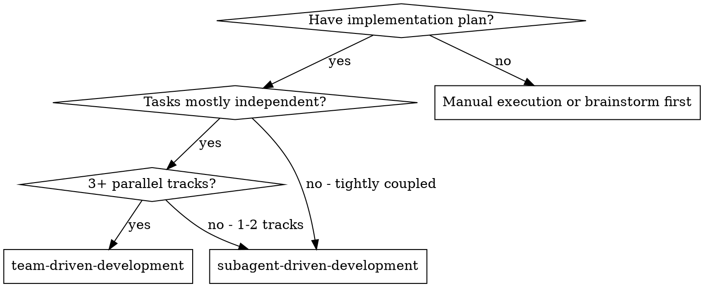
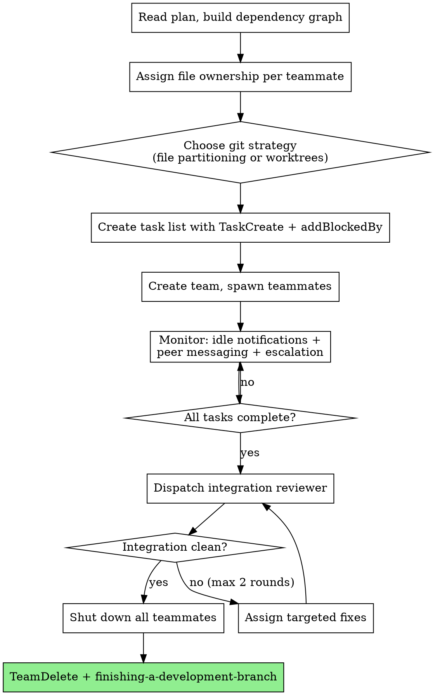

# Team-Driven Development

**Platform requirement:** This skill requires Claude Code v2.1.32+ with agent teams enabled (`CLAUDE_CODE_EXPERIMENTAL_AGENT_TEAMS=1` in environment or settings.json). On other platforms (Cursor, Codex, OpenCode, Gemini CLI), use subagent-driven-development or executing-plans instead.

Execute plan by creating an agent team where multiple teammates work simultaneously on independent tracks, communicate directly with each other via SendMessage, and coordinate through a shared task list — delivering faster execution than sequential subagent-driven-development.

**Why agent teams over subagents:** Teammates are fully independent Claude Code sessions that message each other directly, self-claim tasks from a shared list, and load project context (CLAUDE.md, MCP servers, skills) automatically. Unlike subagents, teammates don't report through a controller bottleneck — they coordinate peer-to-peer.

**Core principle:** Parallel tracks + peer communication + adaptive review = speed without sacrificing quality

## When to Use



**vs. Subagent-Driven Development:**

| | Subagent-Driven Development | Team-Driven Development |
|---|---|---|
| **Context** | Own window; results return to controller | Own window; fully independent |
| **Communication** | Report back to controller only | Teammates message each other directly |
| **Coordination** | Controller manages all work | Shared task list with self-claiming |
| **Best for** | Sequential tasks, tight dependencies | Parallel work requiring discussion |
| **Token cost** | Lower (results summarized back) | Higher (each teammate = separate instance) |

**Don't use when:**
- Sequential tasks with heavy dependencies
- Same-file edits that can't be partitioned
- Fewer than 3 parallelizable tasks (overhead exceeds benefit)
- Routine/small tasks where token cost isn't justified

## Prerequisites

- Claude Code v2.1.32 or later (`claude --version` to check)
- Agent teams enabled — set in environment or settings.json:
  ```json
  {
    "env": {
      "CLAUDE_CODE_EXPERIMENTAL_AGENT_TEAMS": "1"
    }
  }
  ```
- Pre-approve common operations (file edits, bash commands) in permission settings before spawning — teammates inherit the lead's permission mode and permission prompts create friction.
- tmux or iTerm2 (with `it2` CLI + Python API enabled) for split-pane mode. Optional — in-process mode works in any terminal.

**Display mode:** Configure in `~/.claude.json` with `"teammateMode": "in-process"` or `"tmux"`, or per-session with `claude --teammate-mode in-process`. Default `"auto"` uses split panes inside tmux, in-process otherwise.

## Team Sizing

- **Minimum:** 2 teammates (below this → use SDD)
- **Sweet spot:** 3-4 teammates
- **Maximum:** 5 teammates (beyond this, coordination overhead exceeds benefit)
- **Tasks per teammate:** 5-6 keeps everyone productive
- **Rule of thumb:** one teammate per independent track in the plan

**Cost awareness:** Token usage scales linearly with team size. Each teammate has its own context window. Use when parallelism saves more time than the tokens cost.

## Platform Constraints

- One team per session — clean up current team before starting a new one
- Lead is fixed for the session's lifetime — can't promote a teammate
- No nested teams — teammates cannot spawn their own teams
- No session resumption — `/resume` and `/rewind` don't restore in-process teammates; spawn new ones after resuming
- Split-pane mode not supported in VS Code integrated terminal, Windows Terminal, or Ghostty

## The Process

The lead (main session) orchestrates the entire lifecycle. Teammates are fully independent Claude Code sessions.



### Phase 1 — Analyze Plan

- Read the plan file, extract all tasks with full text
- Build dependency graph: explicit ("requires Task N") and implicit (shared files, output→input)
- Group independent tasks into parallel tracks
- If fewer than 3 parallel tracks → recommend SDD instead
- Team size: one teammate per track, capped at 5. Target 5-6 tasks per teammate.

### Phase 2 — Assign File Ownership

**Each file gets exactly one owner. No exceptions — parallel edits cause unpredictable overwrites.**

- New files → assigned to the track that creates them
- Existing files being modified → assigned to the track with the most edits
- Shared types/interfaces → created by one track, read-only for others
- If clean partitioning is impossible → use `using-git-worktrees` for per-teammate branches

### Phase 3 — Create Task List

- `TaskCreate` for every task from the plan with full text description
- Set `addBlockedBy` for dependencies — system auto-unblocks when predecessors complete
- Tasks start `pending` — teammates self-claim (file locking prevents race conditions)
- Lead can explicitly assign tasks when domain expertise matters

### Phase 4 — Create Team & Spawn

Each teammate's spawn prompt includes:
- Track focus area and expertise
- File ownership map (their files + all teammates' files for reference)
- Shared interfaces/contracts
- Peer teammate names for direct messaging
- Communication protocol (see below)

Lead's conversation history does NOT carry over — all context must be in the spawn prompt. Project context (CLAUDE.md, MCP servers, skills) loads automatically.

**Plan approval mode:** For risky tracks (core architecture, shared infrastructure), require plan approval — teammate drafts plan in read-only mode, lead approves or rejects with feedback. Set criteria in spawn prompt (e.g., "only approve plans that include test coverage").

### Phase 5 — Monitor & Coordinate

- **Idle notifications** arrive automatically when teammates finish work
- **Lead stays hands-off** — coordinate and route, do NOT implement tasks. If you start coding, stop and wait.
- **Task dependency flow** — completed tasks auto-unblock dependents
- **Task status lag** — if a task appears stuck, check if work is done and update manually via `TaskUpdate`
- **User can intervene** — Shift+Down (in-process) or click pane (split-pane) to message any teammate directly

### Phase 6 — Integration Review

After all tasks complete, dispatch integration reviewer (see `./integration-reviewer-prompt.md`). Maximum 2 review rounds — if critical issues persist, escalate to user.

### Phase 7 — Cleanup

- Send shutdown request to each teammate. They approve or reject (if still working).
- **All teammates must be shut down before TeamDelete** — it fails if any are running.
- Orphaned tmux sessions: `tmux kill-session -t <session-name>`
- If worktree mode: merge branches, clean up worktrees
- Invoke `finishing-a-development-branch`

**Storage:** Team config at `~/.claude/teams/{team-name}/config.json`, task list at `~/.claude/tasks/{team-name}/`.

## Communication Protocol

Every teammate receives this protocol in their spawn prompt.

**Three channels:**

| Channel | Mechanism | When |
|---|---|---|
| **Peer-to-peer** | `SendMessage` type `message` to named teammate | Quick questions, sharing outputs, discoveries affecting one peer |
| **Broadcast** | `SendMessage` type `broadcast` | Team-wide announcements (interface changes). Use sparingly — costs scale with team size. |
| **Escalate to lead** | `SendMessage` type `message` to lead | Architectural decisions, file ownership conflicts, peer can't resolve |

**Message guidelines:**
- Plain text, not structured JSON
- Messages delivered automatically — send and continue working
- Be specific: "I need the response shape for GET /api/users" not "I have a question"
- Include file paths when referencing code
- Keep short — each message costs tokens for the recipient

**Anti-patterns:**
- Don't broadcast what affects only one peer — direct message them
- Don't poll peers for status — check the task list
- Don't have extended conversations — if 2-3 messages don't resolve it, escalate to lead
- Don't use lead as relay — message peers directly

**User interaction:** Shift+Down (in-process) or click pane (split-pane) to message any teammate directly. Ctrl+T toggles the task list.

## Adaptive Review Strategy

Three layers replace SDD's per-task two-reviewer model to avoid bottlenecking parallel execution.

| Layer | When | Mechanism | Purpose |
|---|---|---|---|
| **Plan approval** | Before implementation (selective) | Built-in plan mode | Catch direction problems before code is written |
| **Self-review** | After every task | Inline in team-implementer prompt | Catch issues without dispatching a reviewer |
| **Integration review** | After all teammates finish | `./integration-reviewer-prompt.md` | Catch cross-cutting issues no single agent can see |

**Plan approval (selective):** Use for tracks touching core architecture or shared infrastructure. Skip for straightforward tasks with clear specs. Lead decides at spawn time.

**Self-review (every task):** Completeness, quality, file ownership discipline, testing, contract compliance. Plan approval validates *what* to build; self-review validates *how* it was built. Both apply.

**Integration review (once):** Contract compliance across tracks, naming consistency, conflict detection, data flow, cross-track test coverage. Maximum 2 rounds — escalate to user if issues persist.

**Why not per-task review?** With 4 agents × 5 tasks × 2 reviews = 40 reviewer dispatches. Adaptive strategy: N plan approvals (selective) + 0 dispatches during execution + 1 integration review. Same quality, no bottleneck.

**Optional quality gates:** Configure `TaskCompleted` hook (exit code 2 prevents completion), `TeammateIdle` hook (keeps teammates working), `TaskCreated` hook (enforces task standards).

## Error Recovery

| Failure | Recovery |
|---|---|
| **Teammate stuck** | Lead messages directly. If unrecoverable, spawn replacement with same file ownership. |
| **Teammate edits wrong files** | Revert unauthorized changes. Reassign fix to correct owner. |
| **Teammate claims wrong task** | Lead reassigns via `TaskUpdate`. Revert if work started on wrong files. |
| **Task status lag** | Lead checks if work done, manually updates `TaskUpdate` or nudges teammate. |
| **Plan approval loop (3+ rejections)** | Lead provides the plan directly or spawns replacement with more context. |
| **Peer message unanswered** | Lead routes the answer or nudges the receiver. |
| **Lead starts implementing** | User tells lead: "Wait for your teammates to complete their tasks." |
| **File conflict despite ownership** | Lead determines correct version using ownership map. Assigns fix to owner. |
| **Shared interface changes mid-execution** | Changing teammate MUST broadcast immediately. Lead verifies acknowledgment. |
| **Multiple teammates fail** | Lead triages: related (fix root cause) or independent (spawn replacements). |
| **TeamDelete blocks** | Shut down all teammates first. If unresponsive: `tmux kill-session -t <name>`. |
| **Session interrupted** | On resume: spawn new teammates, check task list for incomplete tasks. |
| **Integration issues after 2 rounds** | Escalate to user. Don't loop endlessly. |

## Red Flags

**Never:**
- Start implementation without creating file ownership map first
- Let two teammates edit the same file
- Skip integration review because "self-review is enough"
- Let lead implement tasks instead of coordinating
- Ignore teammate escalations (BLOCKED, NEEDS_CONTEXT)
- Send broadcast for single-peer questions
- Loop integration review more than 2 rounds
- Force-kill teammates without sending shutdown request first

## Integration

**Required workflow skills:**
- **superpowers:using-git-worktrees** — Set up feature branch before starting; per-teammate branches if file overlap unavoidable
- **superpowers:writing-plans** — Creates the plan this skill executes
- **superpowers:finishing-a-development-branch** — Complete development after all tasks

**Teammates automatically use:**
- **superpowers:test-driven-development** — TDD when the plan specifies it
- **superpowers:systematic-debugging** — Available if teammates hit bugs
- **superpowers:verification-before-completion** — Verify before marking tasks done

**Prompt templates:**
- `./orchestrator-prompt.md` — Lead's operating guide
- `./team-implementer-prompt.md` — Teammate spawn prompt
- `./integration-reviewer-prompt.md` — Cross-agent integration review
